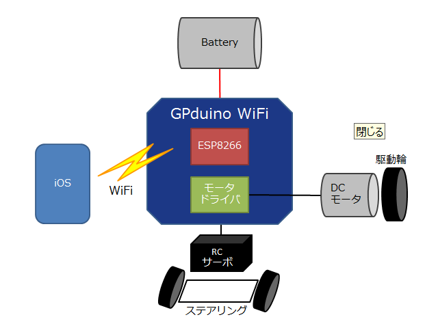
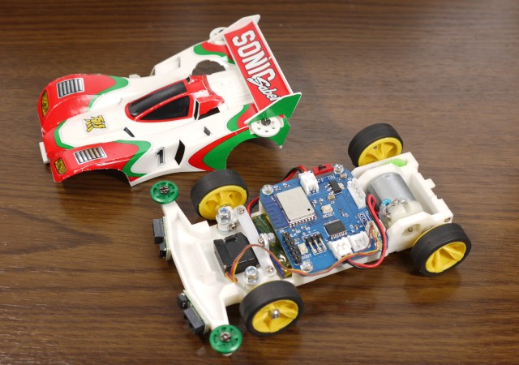
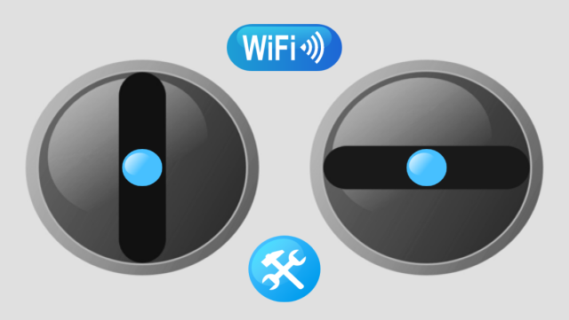
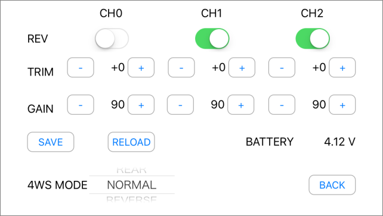

GP Propo WiFi (iOS版)
=========

## 概要
GPduino WiFiを使ったBLEラジコンのためのプロポアプリです。（iOS版）  
GPduino WiFiは、ESP8266搭載のWiFiラジコン制御ボードです。  
GPduino WiFiに関する詳細は、[GPduino特設ページ](http://lipoyang.net/gpduino)をごらんください。

ラジコンは、GPduino WiFiとRCサーボやDCモータを組み合わせて作ります。  
下図はミニ四駆を改造して作ったラジコンです。

## アプリの操作

* GPduino WiFiはWiFiのアクセスポイントになるので、まずiOSをそちらに接続します。
* SSIDはesp8266-* で、パスワードは 12345678 です。
* 通信できる状態になると上部のWiFiインジケータが青になります。
* 通信できない場合は上部のWiFiインジケータが赤になります。
* 見てのとおり、ラジコンプロポの要領で2本のスティックを操作します。
* 設定ボタンを押すと、設定画面に遷移します。

* RCサーボ CH0～2の、反転、トリム、ゲインを設定できます。
* REVのスイッチをONにすると、サーボの回転方向が反転します。
* TRIMの数値を上下すると、サーボのニュートラル位置を調整できます。
* GAINの数値を上下すると、サーボの回転幅を調整できます。
* SAVEボタンを押すと、設定をGPduinoの不揮発メモリに保存します。
* RELOADボタンを押すと、GPduinoの不揮発メモリから設定を読み出します。
* 4WS MODE は、RCサーボ CH1(前輪)
とCH2(後輪)を使った四輪操舵のモードを設定します。
    * FRONT は、前輪のみのステアリング
    * REAR は、後輪のみのステアリング
    * NORMAL は、前輪と後輪が同相の四輪操舵
    * REVERSE は、前輪と後輪が逆相の四輪操舵
* BATTERYは、バッテリー電圧を表示します。

## 動作環境
### システム要件
* iOS 7.1 以降の端末
* Xcode 8以降
* GPduino WiFi
* DCモータとRCサーボを有するラジコンカー または DCモータ2個を有するラジコン戦車

### 確認済み環境

* iPod touch (第6世代), iOS 10.1.1, 4インチ(1134×640)

## ファイル一覧

* GPPropoWiFi/: プロポアプリのソース一式
* LICENSE: Apache Licence 2.0です
* README.md これ

## 開発環境と依存ライブラリ
* このアプリは、Xcodeで開発されました。
* このアプリは、[CocoaAsyncSocket](https://github.com/robbiehanson/CocoaAsyncSocket)に依存しています。
    * CocoaAsyncSocketのインストール方法は、[こちら](http://d.hatena.ne.jp/licheng/20161221/p1)で解説しています。
